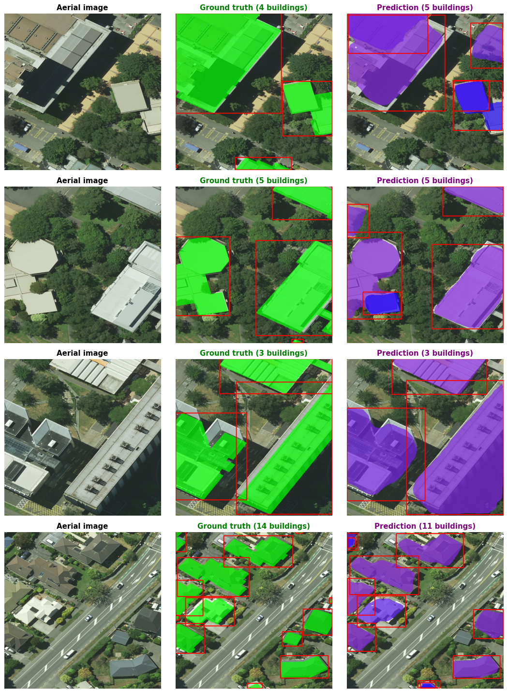
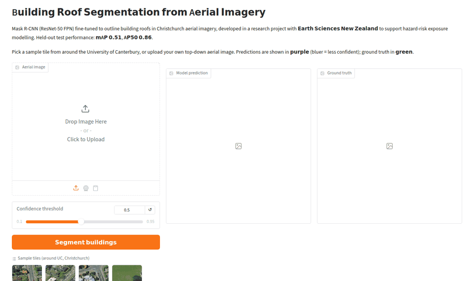

# Building Roof Segmentation from Aerial Imagery

Automatically outlining buildings in high-resolution aerial photos of Christchurch, to support natural-hazard exposure modelling.

Developed as a scholarship-funded summer research project with **Earth Sciences New Zealand (ESNZ)**, as part of my Master of Applied Data Science at the University of Canterbury.



*Left to right: aerial image, ground-truth building outlines (LINZ), model prediction. Purple = confident prediction, blue = less confident.*

## Why it matters

Hazard-risk models estimate the damage an earthquake, flood or tsunami could cause, which depends on knowing **where buildings are**. Building datasets are often maintained by hand and go out of date. This project tests whether a deep learning model can extract building outlines automatically from aerial imagery.

## Results

A fine-tuned **Mask R-CNN** (ResNet-50 FPN backbone) on held-out test data:

| Metric | Validation | Test |
|---|---|---|
| mAP (IoU 0.50–0.95) | 0.519 | **0.510** |
| AP50 | 0.874 | **0.859** |
| AP (large buildings) | 0.731 | 0.722 |
| AP (medium buildings) | 0.567 | 0.557 |
| AP (small buildings) | 0.168 | 0.141 |

Validation and test scores are closely aligned, showing the model generalises to unseen imagery. It performs best on medium and large buildings, which matter most for exposure modelling.

## Approach

- **Data:** LINZ *Christchurch 0.075 m Urban Aerial Photos (2020–2021)* and *NZ Building Outlines*, matched to the same capture period to avoid labelling errors. Large orthophotos were cut into tiles with COCO-format instance masks.
- **Experiments:** 30+ controlled runs with fixed random seeds, varying image resolution, training-set size, learning rate and backbone (frozen vs fine-tuned, ResNet-50 vs ResNet-101). Accuracy levelled off at about 5,000 training tiles.
- **Final configuration:** 224×224 tiles, ~5,000 images, learning rate 0.009, fully fine-tuned ResNet-50.
- **Comparison:** a transformer-based model (Masked Autoencoder encoder with a segmentation decoder) was explored to see how global context changes the errors.

## Where it struggles

On the University of Canterbury campus, the model:

- splits rooftop structures (plant rooms, stairwells) into separate buildings, because it has no concept that buildings don't sit on top of other buildings;
- occasionally mistakes a long, tree-covered path for a roof, because convolutional features are local. The transformer-based model handled this case better.

## Interactive demo



*The Gradio app: pick a sample tile or upload your own top-down aerial image, adjust the confidence threshold, and compare the prediction with the ground truth. A hosted live version is coming soon; for now it runs locally.*

### Run it locally

The trained weights are not included in this repository.

```bash
pip install -r requirements.txt
# Windows
set MODEL_PATH=path\to\optimised_config.pt
# macOS / Linux
export MODEL_PATH=path/to/optimised_config.pt
python app.py
```

Then open http://127.0.0.1:7860. It runs on CPU (about 2 seconds per tile) or GPU.

## Repository contents

```
app.py            Gradio web demo
inference.py      model loading, prediction and drawing
samples/          sample tiles and their ground-truth outlines
figures/          result figures and demo recording
```

## Credits

- Imagery and building outlines: [Land Information New Zealand (LINZ)](https://data.linz.govt.nz/), licensed under CC BY 4.0.
- Model architecture: Mask R-CNN from [torchvision](https://github.com/pytorch/vision).
- Supervision: Rob Buxton and Florent Aden (Earth Sciences New Zealand).
- AI-assisted coding was used for parts of the data preprocessing, visualisation and this demo app; all experimental design, analysis and interpretation are my own.
